<h1 align="center">RE:Neon II</h1>

    
    ELP-03 FROM OXTRE..

## Overview

A amazing smart watch with in-16(Nixie tube).

 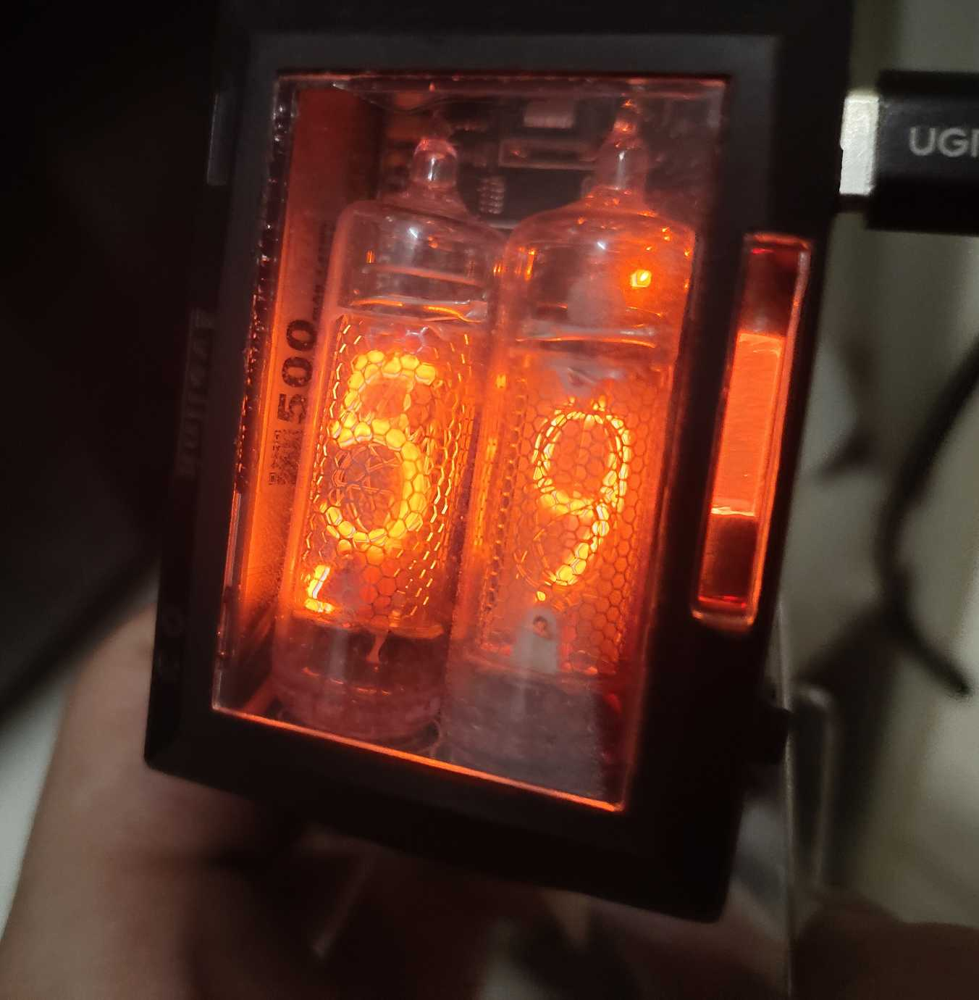

 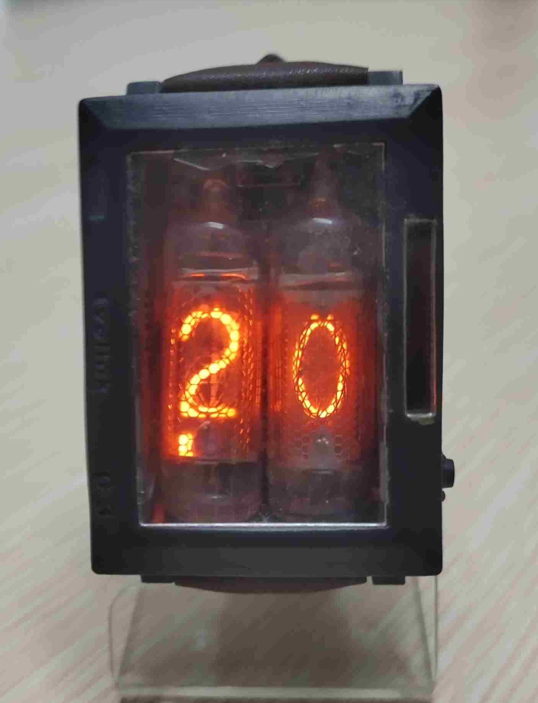
 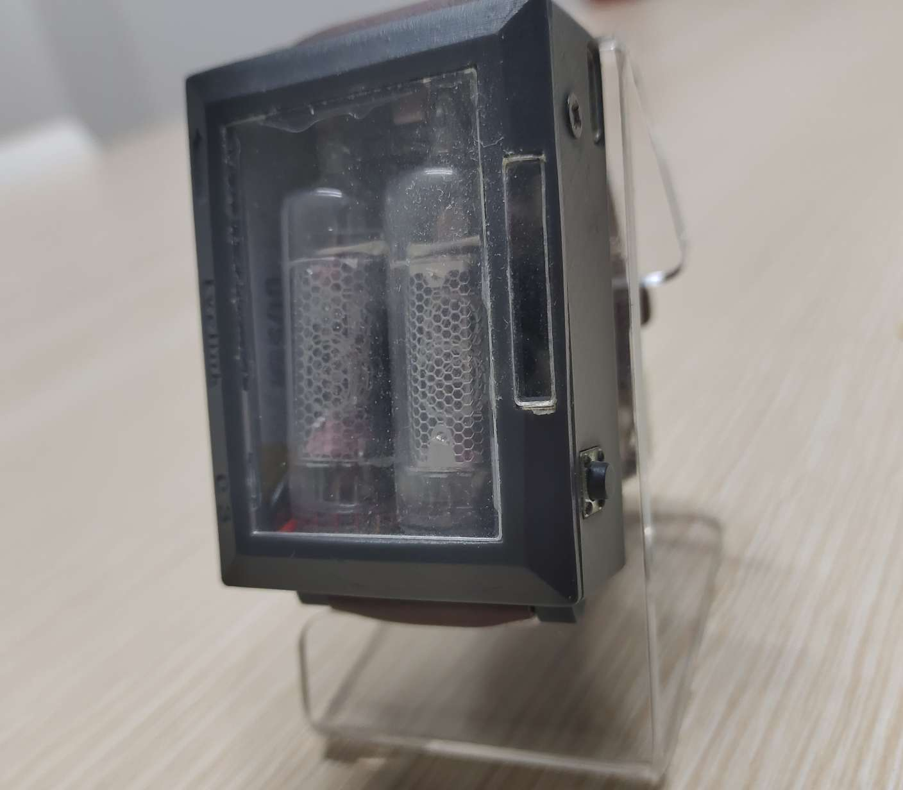

## Nixie tube

Nixie tubes are vintage gas-discharge display devices that produce a mesmerizing orange-red glow. They were widely used in early digital instruments and clocks, and today, they’re prized for their retro aesthetic.

Nixie tubes are a beautiful marriage of physics and engineering. While obsolete for practical displays, their nostalgic charm ensures they’ll keep glowing for decades to come.

They glow through gas discharge when high voltage (~170V) is applied.

 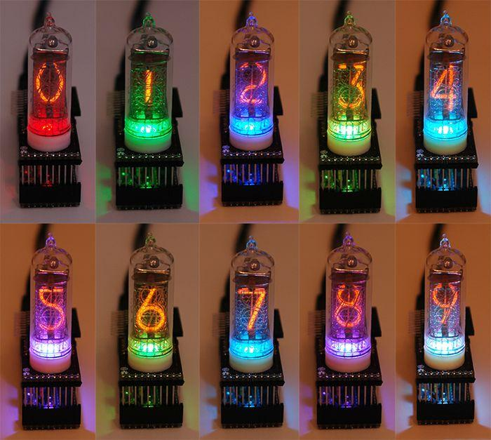

 

After a lot of selection, I finally chose to use the `IN-16` for this project.

The beautiful glow in the dark:

 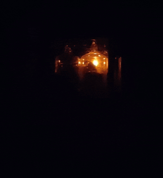

## Features

1. DISPLAY : IN-16 x2 (obviously)
2. RGB : ws2812b x2 + SEFUSE 5x20mm
3. POWER : TP4056D + TPS78233
4. MCU : esp32-Pico-D4
5. RTC : ds3231mz+
6. ACCE : LIS331DLHTR
7. key : 6x6x5mm botton
8. BAT : 502035 500ma

 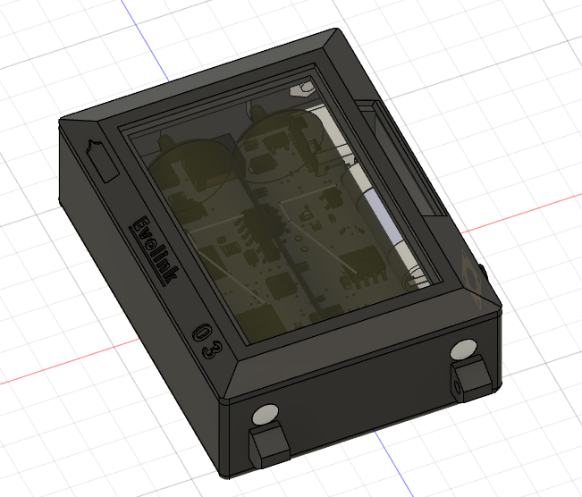

 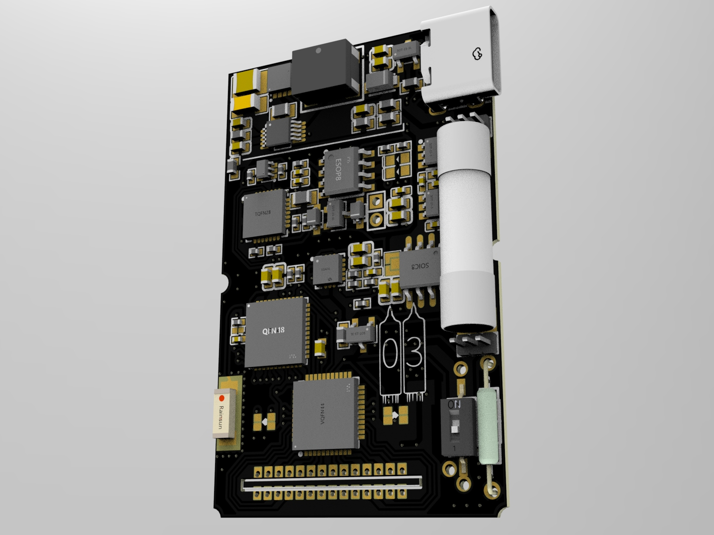

Carefully install the LED tube, which is done by soldering the wire on the WS2812 (LED), pasting the LED and the light guide post and then plugging it into the fuse housing.

 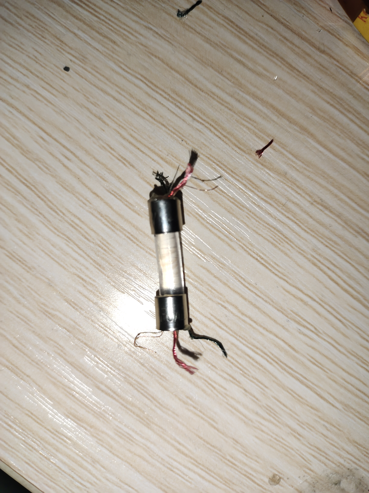

This is the complete PCB board (does not include the tube base)

 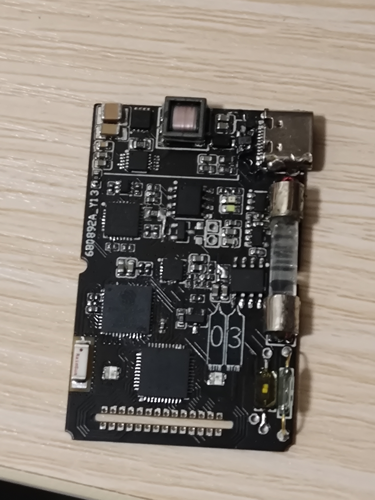

## Program

Serial debugging and programming of ESP32 using `typec` interface (built-in CP2102)

## Use

Press the button or shake your arm to display the time

## Whats New

It's clear that we've made significant improvements in size and integration

Here is the actual circuit board of version 1.0:

 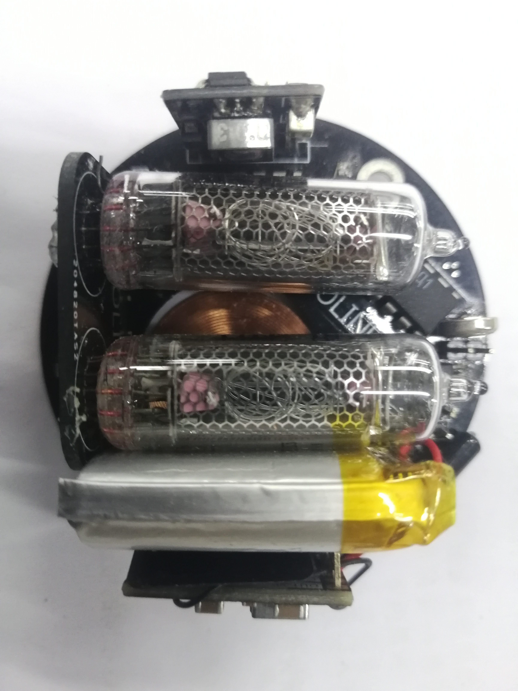

 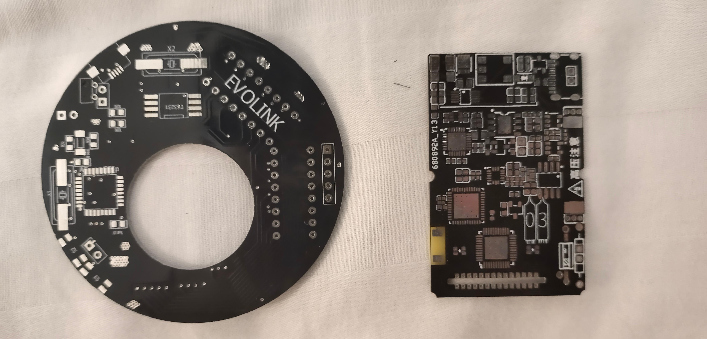

## And More?

 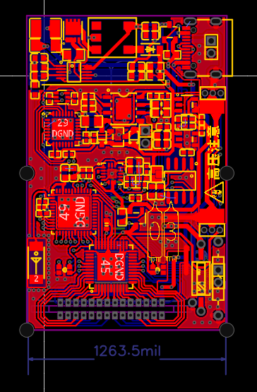
 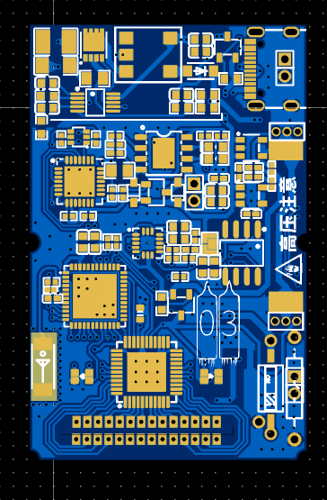
 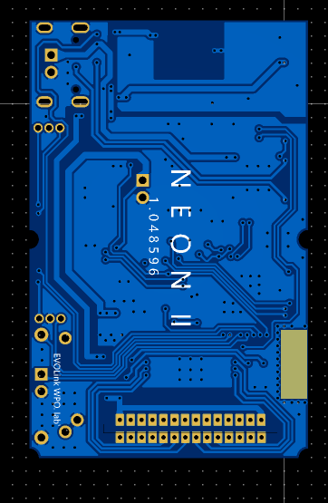

